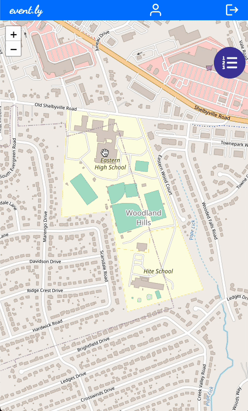

# event.ly

event.ly is a map-based web application for finding and creating events to connect with people in your local community.

[Live app](https://event-ly.netlify.app/)

## Features

### Front-end

- Displays an interactive map for viewing local events.
- Click pins on the map to display information about an event.
- On landing in the homepage the map pans to the user location (if allowed) or to a backfall location.
- Create an event by selecting a spot on the map.
- Filter the event by category and dates to narrow results in the map and list view.
- Sort the event by proximity, date, name, number of guests.
- Click on an event in the list to pan the map to that event.
- Participate to events and comment on those events.
- Update and delete the created events in the personal user page.
- See all paricipating events in the personal user page.
- From the user page click an event to center the map to that event.

### Back-end

- Used Node and Express to manage user and event data.
- Configured Express Router to handle application endpoints for GET, POST, PUT and DELETE methods.
- Implemented full CRUD functionality with Model-View-Controller design pattern.
- Modelled the data structure with Mangoose database schema.
- Storing, accessing, editing data in a cloud database via asyncronous database calls.
- Retrieving information from Bing Map API for reverse geocoding (coordinates on map -> address).
- Retrieving images from Unsplash API to let user pick pictures for their event.
- Application deployment on Heroku cloud platform.

# Screenshots

## Desktop

### Home Page and Filters

### Participate and Comment

### Create an Event

### Update and Delete an Event

## Mobile

 

 

## Technologies Used

### MERN Stack Application

- HTML
- CSS
- JS
- Tailwind
- Daisy
- React
- Node
- Express
- Mongo DB
- Mongoose
- Heroku
- Netlify

## Icebox Feature

- [ ] Form animations
- [ ] Multilanguage support
- [ ] Multi-step form for adding events
- [ ] Loading spinner
- [x] Pop-up Toast confirmation when event is added
- [ ] Find related events, when viewing a particular event
- [ ] Notification, confirmation if I have joined an event
- [ ] Notification, if an event I am attending has a new comment posted
- [ ] Notification, if a reply is added to your comment
- [ ] Notification, if an event I have attended, creates another one
- [ ] Favorite types, would like to save event filters as a favorite event-type profile
- [ ] Infinite scroll for event list
- [ ] Subscriptions, allow users to subscribe to a type of event like 'tech events' and see a section showing all 'tech events' in a given area
- [ ] Share invite to friends on event.ly
- [ ] Add event to Google/outlook/etc calendar

